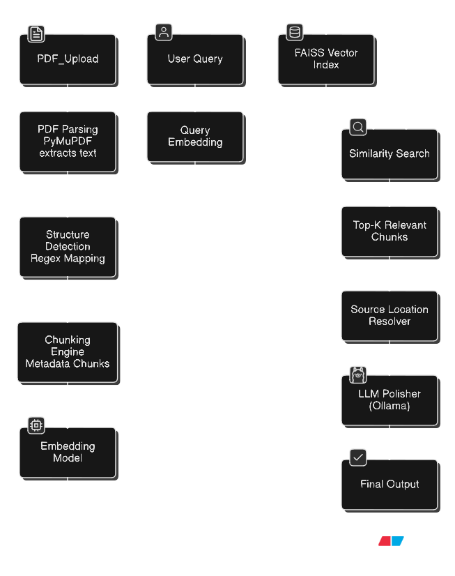
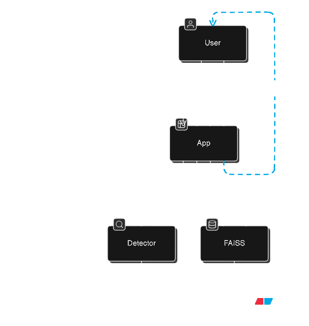

# Textbook Mapping Assistant

The Textbook Mapping Assistant is a privacy-first, offline Retrieval-Augmented Generation (RAG) system designed specifically for academic integrity, transparency, and trust. Rather than functioning as a conventional question-answering chatbot, the system acts as an Explainable AI (X-AI) navigation layer over textbooks.

Its purpose is not to replace reading or interpretation, but to guide users precisely to where knowledge exists in the original material. Every response is anchored to verifiable textbook locations, enabling users to independently read, validate, and understand concepts in their proper academic context.

Unlike traditional RAG systems that generate free-form answers and risk hallucination, this assistant resolves queries to exact page numbers, sections, and units. This makes it especially suitable for academic settings where correctness, attribution, and integrity are more important than convenience.

## Key Advantages

| Aspect             | Traditional RAG  | This System     |
| ------------------ | ---------------- | --------------- |
| Output             | Generated answer | Source location |
| Hallucination risk | Medium–High      | Near zero       |
| Explainability     | Weak             | Strong          |
| Academic usage     | Risky            | Ideal           |
| Ethics compliance  | Debated          | Clean           |

### Core Principles

* **Completely Offline**: All processing, from embedding to inference, happens locally.
* **No Data Leakage**: Academic documents never leave the user’s machine.
* **Academic Integrity**: Encourages reading the original text instead of consuming AI summaries.

## System Architecture

The system operates entirely inside a **local, offline environment** with full traceability.

### Architecture View




### Component Responsibilities

* **PDF Parser (PyMuPDF)**: Extracts raw text while preserving exact page numbers.
* **Structure Detector**: Uses regex rules to detect Units, Chapters, and Sections.
* **Chunking Engine**: Creates small semantic chunks and attaches page and section metadata.
* **Embedding Model**: Converts text into vectors for semantic similarity search.
* **FAISS Index**: Performs fast offline vector search.
* **Source Location Resolver**: Converts chunk-level matches into readable page ranges.
* **LLM Polisher**: Improves academic tone without adding new information.

## Prerequisites & Installation

To maintain a fully offline workflow, all model weights must be downloaded locally.

### 1. Large Language Model (Polishing)

The system uses **Llama 3.2 3B** via Ollama only for language polishing.

* Ollama website: [https://ollama.com](https://ollama.com)
* Llama 3.2 model: [https://ollama.com/library/llama3.2](https://ollama.com/library/llama3.2)

```bash
ollama pull llama3.2:3b
```

### 2. Embedding Model

The system uses the **all-MiniLM-L6-v2** sentence transformer.

* Hugging Face model: [https://huggingface.co/sentence-transformers/all-MiniLM-L6-v2](https://huggingface.co/sentence-transformers/all-MiniLM-L6-v2)

Ensure `MODEL_PATH` in `main.py` points to the local model directory.

### 3. Python Dependencies

```bash
pip install faiss-cpu fastapi pymupdf sentence-transformers uvicorn python-multipart
```

## How to Use

### 1. Launch the Server

```bash
uvicorn main:app --reload
```

### 2. Upload Textbooks

* Open `http://127.0.0.1:8000`
* Upload PDF files
* Chapters and sections are detected automatically

### 3. Query the System

Example output:

> “The topic *Quantum Mechanics* is discussed on pages **112–115**, Section **4.2**.”

## Explainable AI (X-AI) Workflow



## Outcome
The Textbook Mapping Assistant delivers a fundamentally different outcome compared to conventional AI learning tools. Instead of producing opaque or potentially misleading answers, it provides traceability, reliability, and academic confidence.

By grounding every response in explicit textbook locations, the system:

* Reduces hallucinations to near zero
* Reinforces citation-aware and source-first learning
* Encourages deeper engagement with original material
* Supports educators in maintaining academic honesty
* Enables institutions to adopt AI tools without privacy or ethics concerns
  
Overall, the system demonstrates how AI can responsibly augment education by acting as a navigation and discovery assistant, not a replacement for original academic content.
